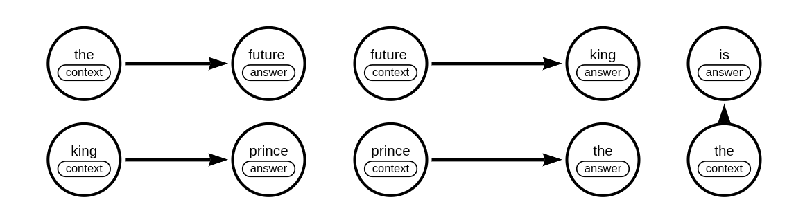
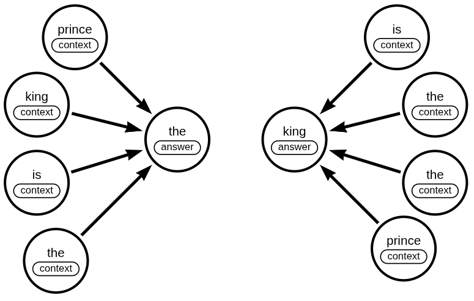

# BUILD VECTOR STORE and  SEARCH From Scratch


---

### NOTES
- word2vec, don't use bigram because its's to compute expensive, only words on low data.
- Lesson some chunks that are right after each other might not share the similar vector space even though they are from the same
- How do i test how good my vector databae actually is?

## My plan: TODO
- [x] **Embeddings:** Train Word2Vec model to generate vector representations.
    - [x] my own custom made word2vec - trying to do bi-gram
        - [x] Build vocab
        - [x] Train a model
    - [x] A normal one

- [x] **Built my own custom made doc2vec**
    - [x] use word2vec to build doc2vec, avg the vectors from the bigram word2vec to make the doc2vec
    - [ ] build the embedding

- [x] **Query/Similarity Function:** Implement a search function to query the vector store and retrieve the most similar vectors to a given input.
    - [x] my own custom made

- [ ] **Find a good way to test and eval and compare with other solutions**

- [ ] **Build a taste2vec** Build it on like netflix ratings or something. Similar to tinvec

--- 
## What i learned

Vector databases are not great for exact or ultra-rare word searches (like usernames). They’re optimized for similarity, not exact match. For unique or rare strings, use a classic keyword/text search (e.g., Elasticsearch) or a database index, not a vector search. Vector DBs can miss or “fuzz” exact results. Don’t use them for this case.





Skipgram uses a neural network model to learn word embeddings by predicting context words from a center word.

Bigram does not use a model—it’s just counting adjacent word pairs (pure statistics, no learning or embeddings).

#### Bigram:

- Counts or models pairs of consecutive words (e.g., “king is,” “is wise”).
- Used in classic NLP for statistical language modeling.
- No “learning” beyond co-occurrence counts.

---

#### Skipgram:

- Trains a model to predict context words given a center word.
- Example: In “the king is wise,” if “king” is center, model predicts “the,” “is,” etc.
- Used in word2vec to create word embeddings.
- Learns semantic similarity.


---

#### Continues bagging



#### the dataset we want to use for our vector storehttps://www.kaggle.com/datasets/yorkyong/text8-zip


### LICENSE

```markdown
MIT License

Copyright (c) Morris Simons

Permission is hereby granted, free of charge, to any person obtaining a copy
of this software and associated documentation files (the "Software"), to deal
in the Software without restriction, including without limitation the rights
to use, copy, modify, merge, publish, distribute, sublicense, and/or sell
copies of the Software, and to permit persons to whom the Software is
furnished to do so, subject to the following conditions:

The above copyright notice and this permission notice shall be included in all
copies or substantial portions of the Software.

THE SOFTWARE IS PROVIDED "AS IS", WITHOUT WARRANTY OF ANY KIND, EXPRESS OR
IMPLIED, INCLUDING BUT NOT LIMITED TO THE WARRANTIES OF MERCHANTABILITY,
FITNESS FOR A PARTICULAR PURPOSE AND NONINFRINGEMENT. IN NO EVENT SHALL THE
AUTHORS OR COPYRIGHT HOLDERS BE LIABLE FOR ANY CLAIM, DAMAGES OR OTHER
LIABILITY, WHETHER IN AN ACTION OF CONTRACT, TORT OR OTHERWISE, ARISING FROM,
OUT OF OR IN CONNECTION WITH THE SOFTWARE OR THE USE OR OTHER DEALINGS IN THE
SOFTWARE.
```